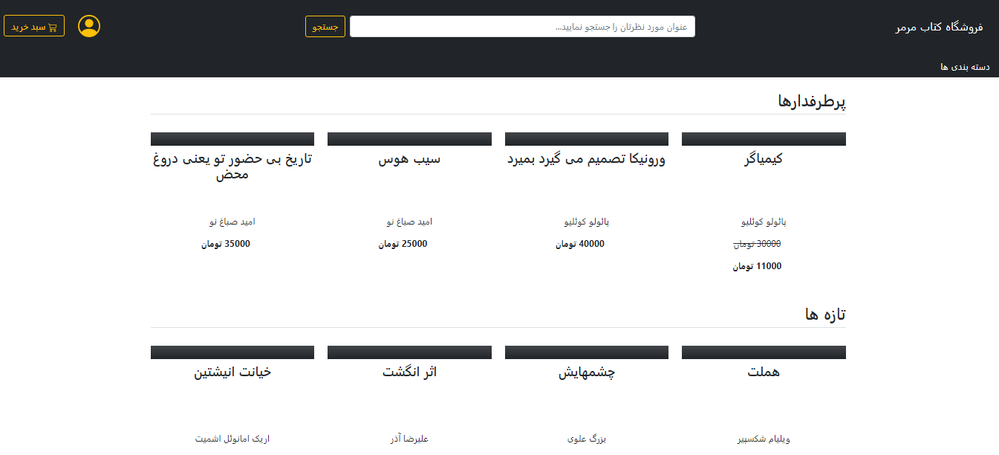

# Book Store

## About The Project

This is an ecommerce website for selling books.
###### homepage

It has three kind of users and each has specific permissions.
* Customers can see all books and their authors and categories, they can add books to their cart, use discount coupons and submit their order.
* Staff users has permission to add, change, delete and view product and discount app models. but they can't buy products for now.
* Admin is a super user which has all permissions but for now I didn't let it to buy products.

### Built With

##### Back end
* [Python](https://www.python.org/)
* [Django](https://www.djangoproject.com/)
##### Front end
* [Bootstrap](https://getbootstrap.com)

## Project tree

 * [BookStoreSrc](./BookStoreSrc/BookStoreSrc)
   * [settings.py](./BookStoreSrc/BookStoreSrc/settings.py)
   * [urls.py](./BookStoreSrc/BookStoreSrc/urls.py)
 * [accounts](./BookStoreSrc/accounts)
   * [views](./BookStoreSrc/accounts/views)
     * [all_user_related.py](./BookStoreSrc/accounts/views/all_user_related.py)
     * [customer.py](./BookStoreSrc/accounts/views/customer.py)
     * [employee.py](./BookStoreSrc/accounts/views/employee.py)
   * [models.py](./BookStoreSrc/accounts/models.py)
   * [forms.py](./BookStoreSrc/accounts/forms.py)
   * [backends.py](./BookStoreSrc/accounts/backends.py)
   * [permissions.py](./BookStoreSrc/accounts/permissions.py)
   * [token.py](./BookStoreSrc/accounts/tokens.py)
   * [admin.py](./BookStoreSrc/accounts/admin.py)
   * [urls.py](./BookStoreSrc/accounts/urls.py)
   * [templates](./BookStoreSrc/accounts/templates)
 * [product](./BookStoreSrc/product)
   * [models](./BookStoreSrc/product/models)
     * [book.py](./BookStoreSrc/product/models/book.py)
     * [author.py](./BookStoreSrc/product/models/author.py)
     * [category.py](./BookStoreSrc/product/models/category.py)
   * [forms](./BookStoreSrc/product/forms)
     * [book.py](./BookStoreSrc/product/forms/book.py)
     * [author.py](./BookStoreSrc/product/forms/author.py)
     * [category.py](./BookStoreSrc/product/forms/category.py)
   * [views](./BookStoreSrc/product/views)
     * [book.py](./BookStoreSrc/product/views/book.py)
     * [author.py](./BookStoreSrc/product/views/author.py)
     * [category.py](./BookStoreSrc/product/views/category.py)
     * [home.py](./BookStoreSrc/product/views/home.py)
     * [search.py](./BookStoreSrc/product/views/search.py)
   * [admin.py](./BookStoreSrc/product/admin.py)
   * [context_processors.py](./BookStoreSrc/product/context_processors.py)
   * [test.py](./BookStoreSrc/product/tests.py)
   * [urls.py](./BookStoreSrc/product/urls.py)
   * [templates](./BookStoreSrc/product/templates)
 * [order](./BookStoreSrc/order)
   * [models.py](./BookStoreSrc/order/models.py)
   * [views.py](./BookStoreSrc/order/views.py)
   * [admin.py](./BookStoreSrc/order/admin.py)
   * [context_processors.py](./BookStoreSrc/order/context_processors.py)
   * [urls.py](./BookStoreSrc/order/urls.py)
   * [templates](./BookStoreSrc/order/templates)
 * [discount](./BookStoreSrc/discount)
   * [models.py](./BookStoreSrc/discount/models.py)
   * [forms.py](./BookStoreSrc/discount/forms.py)
   * [views.py](./BookStoreSrc/discount/views.py)
   * [admin.py](./BookStoreSrc/discount/admin.py)
   * [urls.py](./BookStoreSrc/discount/urls.py)
   * [templates](./BookStoreSrc/discount/templates)
 * [templates](./BookStoreSrc/templates)
